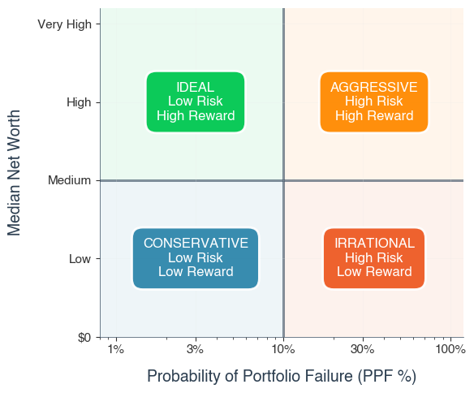

# Motivation

I've struggled over decisions like Roth or Traditional, rent or buy, stock bond ratios, standard or itemized, when to start social secutiry benifits, are annuities a scam, and countless more. Every answer to these questions is probably the best choise for someone, but you still hear people saying oposite things to people in the same situation. I think that is partially because people have different goals, which is valid, but it's also becauase most people are making educated guesses based on gut feeling. I want a more empirically proven answer if I'm going to steak my livelehood on it. While this project obviosly wouldnt be the first to do such a thing, I want it to be comprehensive and simple enough to not just answer questions like these, but provide an optimal path based on anyone's inputs, to achieve thier goals.

# Overview

This project will be a montecarlo simulator of a person's entire financial life, running computations on a monthly basis to emulate what may happen in real life until the household either runs out of money or they reach their life expectancy.
The secondary objective is to then use the results of that simulation to try messing with the inputs that are able to change until the ideal retirement strategy is found for that household

# PPF and Net Worth

The goal of the project being to provide users a path to their retirement goals that is most likley to succede, it feels important to define what I see as the most rational main goal. which is minimizing what I've been calling PPF: Probabilty of Portfolio Failure. $\hat{P} = \frac{ \text{\\# of portfolio failures before death}}{\text{total number of simulations}}$ The more I've thought about it the more rational it feels to choose a path that has any ammount lower PPF, even if it means a significant sacrifice in potiental portfolio value. That being said there are more risk tollerant people than me, and there will inevitably be situations where you can have higher value with equal PPF, so net worth should be tracked as a secondary goal.

These 2 goals can be used as the axes of a scatter plot on which every strategy can be assessed depending on the user's risk tolerance. For my sake, I would only consider the very left side of this plot.

  

## Alternate Reward functions

- are there even any others?
- you could have something like PPF vs retirement age

# Output Aggregation

The dificulty with simulating something over a term as long as a person's life is the quantity of data you need to get a stable result. Given that the values I'm dealing with don't need to be particularly precise, I will use approximations where appropriate. My Distribution Learner, inspired by [this python library](https://github.com/cxxr/LiveStats/blob/master/livestats/livestats.py), which itsef is partially based on [this paper](https://www.cs.wustl.edu/~jain/papers/ftp/psqr.pdf), should give me the best balance of time and space complexity, with $O(1)$ updates and minimal storage needs.
To determine when a metric has "stabilized," I use a heuristic grounded in the Central Limit Theorem (CLT). It estimates either (1) the probability that the current estimate is within a fixed range of the true mean, or (2) the size of the interval around the mean within which I can be a given percentage certain. This provides a practical, interpretable measure of statistical confidence without requiring full knowledge of the underlying distribution.

## What the distribution learner tracks:

- `mean`: Running mean of observed outcomes.
- `count`: Total number of outcomes added.
- `minVal`: Minimum observed value.
- `maxVal`: Maximum observed value.
- `varM2`: Second central moment (for variance calculation).
- `skewM3`: Third central moment (for skewness calculation).
- `kurtM4`: Fourth central moment (for kurtosis calculation).
- `quantiles`: Map of quantile estimators (`0.25`, `0.5`, `0.75`) using the P² algorithm.
- `precisionTarget`: Target width for confidence interval (used in stability checking).
- `meanStability`: `StabilityChecker` instance tracking convergence of the mean.

## Modes of operation

There will be 2 modes of operation, when exploring differnt paths, the only thing that really matters is tracking a user's goal. In the case of PPF that would requre very little data, just 2 ints. Once an optimal path is found and you really want to explore it though, each investment within each account would need to be tracked with one of these Distribution Learners, which could then be summarized and checked for stability incrementally. This would provide much more information for a user to explore. and to inform what the impact of this strategy would be. All that being said if the cost of running the distribution learner everywhere is minimal the extra data would be very cool to see.

# Data Locations

> Eventually I'd like to compile all the needed outside data into a single sqllite db that could be frequently updated in a semi automatic way

## Historic Data

- [Consumer Price Index (Inflation)](https://fred.stlouisfed.org/series/CPIAUCSL) 1950+
- [Dow Jones](https://fred.stlouisfed.org/series/M1109BUSM293NNBR) 1915+
- [Total Market](https://fred.stlouisfed.org/series/SPASTT01USM657N) 1957+
- would be better to have small medium and large cap as well
- Still looking for annuity data
  - Consider reconstructing this? https://www.schwab.com/annuities/fixed-income-annuity-calculator - doesnt take into account historic changes
- [International Markets](https://fred.stlouisfed.org/series/SPASTT01EZM661N)
- [Moody's AAA Corporate bonds](https://fred.stlouisfed.org/series/AAA) 1920+
- [Federal Bonds](https://fred.stlouisfed.org/series/DGS10) 1962+
- [Gold](https://www.macrotrends.net/1333/historical-gold-prices-100-year-chart) 1915+
- [Silver](https://www.macrotrends.net/1470/historical-silver-prices-100-year-chart) 1915+
- [Home Prices](https://fred.stlouisfed.org/series/MSPUS) 1965+
- [Income](https://fred.stlouisfed.org/series/MEHOINUSA672N) 1985+
- [Rent](https://fred.stlouisfed.org/series/CUUR0000SEHA) 1914+
- Still looking for data on HYSAs / General interest rate data

- Data Types:
  - simple monthly return
  - yearly return updated monthly
  - indexes (like CPI)
  - values (i.e. $n invested over time)

## Tax Data

> TBD

## Social Security data

> TBD

## Life Expectancy / Health

- [Male](https://www.mortality.org/File/GetDocument/hmd.v6/USA/STATS/mltper_1x1.txt)
- [Female](https://www.mortality.org/File/GetDocument/hmd.v6/USA/STATS/fltper_1x1.txt)
- Still looking for data on multipliers for good or poor habits / health / family history
- Still looking for data on medical expenses?

## Inflation

Inflation is dealt with via CPI, I feel like there is an opportunity to handle things by specific CPI rates instead of general
I don't know if I should leave everything unaffected (i.e. in today's dollars) and just decrease market rates by CPI values
alternative is to increase everything

# Project Structure

## Household

A household is the central part of a simulation, everything connects back to it, money flows in and out of it, etc.

## Household factor

A household tracks a list of household factors, each being something that affects the finances of a house. An example may be one members income, or an expense, or social security, or taxes.

## Ecnomic Factor

An economic factor is where the historic data comes in. An example would be inflation. For each month of the simulation a new return value for each economic factor is detirmined, and that is used to increment a household's portfolio
The return values will be generated with Geometric Brownian Motion (GBM) CITATION OR SOMRTHING BETTER

## Account

A household also has a list of accounts, such as an HYSA, RothIRA, 401k, mortgage, etc. Each matching the rules of that account in real life, such as tax implications and allowed economic factors

## Investment

Each account holds a series of investments based on what is allowed by the account and what is being utilized by the household, it contains a refrence to the relevalant economic factor, and a simple integer for it's current value.

## Simulation

This takes a household and data informed economic factors to run actual month by month simulations on a household until life expectancy, repeating until some count or stability metric is reached. Each thread can contain it's own simulation with copies of the source household and seeds of randomness for the economic factors and life expectancy

## Structure

unknown

# Figuring out the inputs

you may know how much you make now, that you want to some day buy a house, have kids, etc,
but how should that be accounted for, carreer growth / changes etc
life expectancy like above

# Using the tool

runs based on a configuration file that has all the input info and settings for the simulation
choose what to save, like maybe only save means to save time for each investment to avoid complication

# My notes:

- Period_Life_Data could be used in an inheritance account to represent the parent
- also the 'household' may technically need 2 of them for the 2 members

## Next Steps:

1. Implement some testing
2. Create a flag for a heavy logging version and a light version
   - consider if this flag should be in code or not
3. Get as much data into the economy as possible
4. Get more data into the household
5. Some form of tax computation
6. Profiling
7. Household Factors need implemented
8. Figure out taxable income vs regular / where income goes
9. Try to write a basic strategy in code
